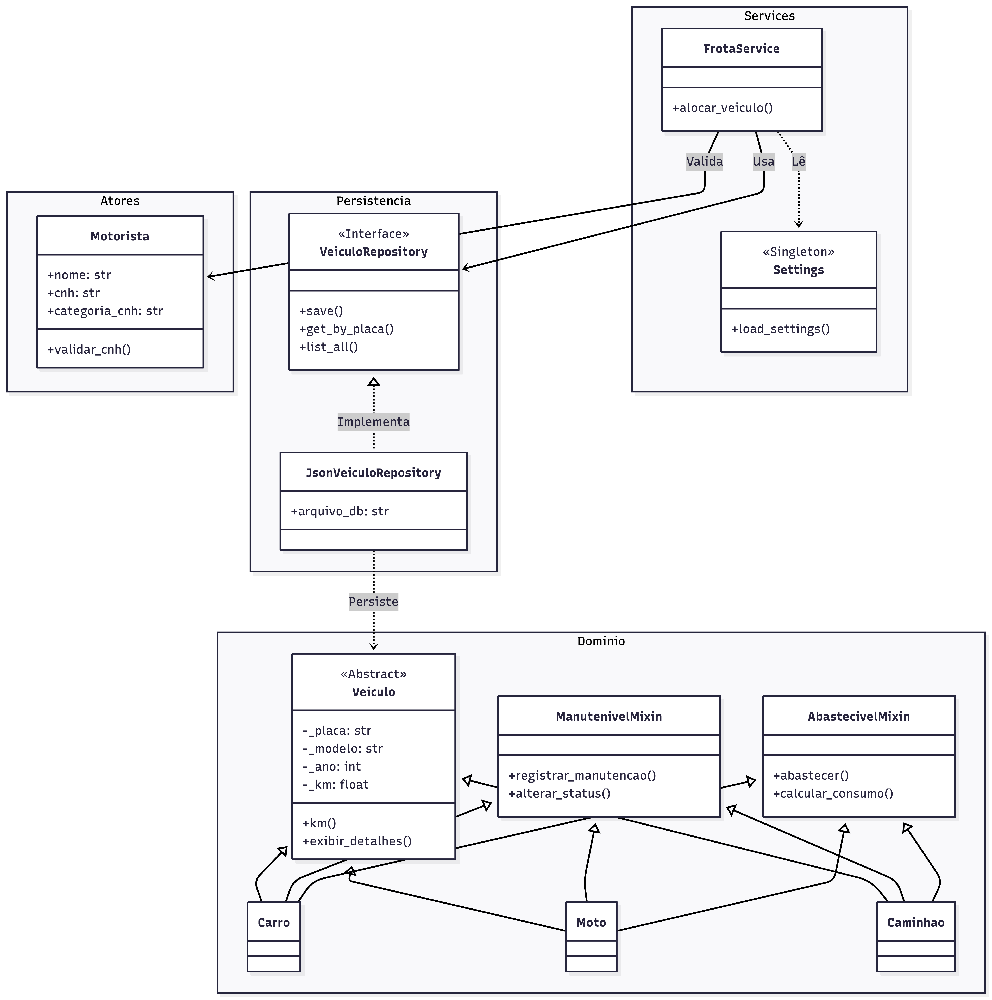

# FrotaSmart-API
API RESTful para gerenciamento inteligente de frotas, motoristas e manutenções preventivas.

## Diagrama

## Lista das principais classes do sistema

### Domínio (Core Domain)
`Veiculo`: (Classe Abstrata): Classe base que define os atributos encapsulados (`_placa`, `_modelo`, `_ano`, `_km`) e métodos abstratos. Implementa `@property` para validações de integridade.

`Carro`, `Moto`, `Caminhao` (Classes Concretas): Herdam de `Veiculo` e implementam especificidades de cada tipo.

`Motorista`: Classe responsável pelos dados do condutor e validação de CNH.

### Mixins (Herança Múltipla - Obrigatório)
`ManutenivelMixin`: Adiciona comportamentos de manutenção (registrar manutenção, alterar status para "EM MANUTENÇÃO").

`AbastecivelMixin`: Adiciona comportamentos de abastecimento (registrar abastecimento, calcular consumo médio).

### Persistência (Padrão Repository)
`VeiculoRepository` (Interface/Abstrata): Contrato que define operações de CRUD (`save`, `get_by_placa`, `list_all`, `update`).

`JsonVeiculoRepository`: Implementação concreta que persiste os dados em arquivos `.json`.

### Persistência (Padrão Repository)
`Settings` (Singleton): Responsável por carregar e validar o arquivo `settings.json` (políticas de manutenção e custos).

`FrotaService`: Camada de serviço que orquestra as regras de negócio (ex: verificar se Motorista tem CNH compatível com Veículo antes de alocar).

### Exceções Customizadas
`VeiculoError`, `ManutencaoInvalidaError`, `AlocacaoError`.

## Descrição de responsabilidades de cada membro

### Membro 1: Felipe Alves Bezerra Neto
`Responsabilidade`: Modelagem do Domínio Base.

`Tarefas`: Implementação da classe abstrata Veiculo e das subclasses Carro, Moto e Caminhao.

### Membro 2: Antonio Lucas da Costa Pereira
`Responsabilidade`: Mixins e Tratamento de Erros.

`Tarefas`: Implementação de ManutenivelMixin e AbastecivelMixin (para cumprir o requisito de herança múltipla) e criação das Exceções Customizadas.

### Membro 3: Rubens Paulo Rodrigues Parente
`Responsabilidade`: Gestão de Pessoas e Validações de Negócio.

`Tarefas`: Implementação da classe Motorista e lógica de validação de CNH (ex: Motorista categoria B não pode dirigir Caminhão).

### Membro 4: Everton Lucas Fernandes
`Responsabilidade`: Persistência de Dados (Repository Pattern).

`Tarefas`: Criar a interface VeiculoRepository e a implementação JsonVeiculoRepository (CRUD). Garantir que o domínio não dependa diretamente do arquivo JSON.

### Membro 5: Antonio Airlon da Silva Filho 
`Responsabilidade`: Interface (API Flask) e Configurações.

`Tarefas`: Configuração do Flask, criação dos Endpoints (Rotas) e implementação da classe Settings para leitura do settings.json.

